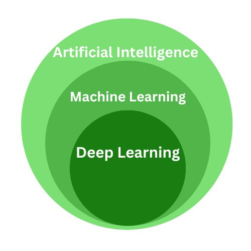

## Getting Started

*Learning in any process by which a system improves performance from experience*
	- Herbert Simon

Lets Start from the very beginning

#### What is Machine Learning?

It's the study of algorithms that learn from the data they are trained on and use this knowledge to make predictions or decisions on unseen data. Instead of being explicitly programmed with specific instructions, these algorithms adapt and improve their performance based on the patterns they identify in the data.

#### Some Buzz Words

Artificial Intelligence, Machine Learning, Deep Learning ; These are some of the most commonly used terms. So what's the difference between the three of them?

The Diagram below would help you understand better.

